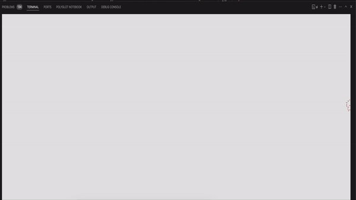

SL(1): Cure your bad habit of mistyping
=======================================

SL (Steam Locomotive) runs across your terminal when you type "sl" as
you meant to type "ls". It's just a joke command, and not useful at
all.

Copyright 1993,1998,2014-2026 Toyoda Masashi (mtoyoda@acm.org) et al.


New ICE 1 with optional n cars (source of ascii art: https://ascii.co.uk/art/train)


## Release History

See [CHANGELOG.md](CHANGELOG.md) for the full version history.

**Latest:** v7.00 – Add ICE 3 Redesign (ICE3RD) with mirrored rear locomotive
and backward mode support; multiple bug fixes and code review improvements.

## Build

```bash
make
./sl -3 -n 3        # ICE 3 Redesign with 3 wagons
./sl -3 -n 3 -b     # same, driving left to right
./sl -h             # show all options
```

Pre-built binaries for Linux (amd64) and macOS (arm64) are attached to each
[GitHub Release](../../releases).
